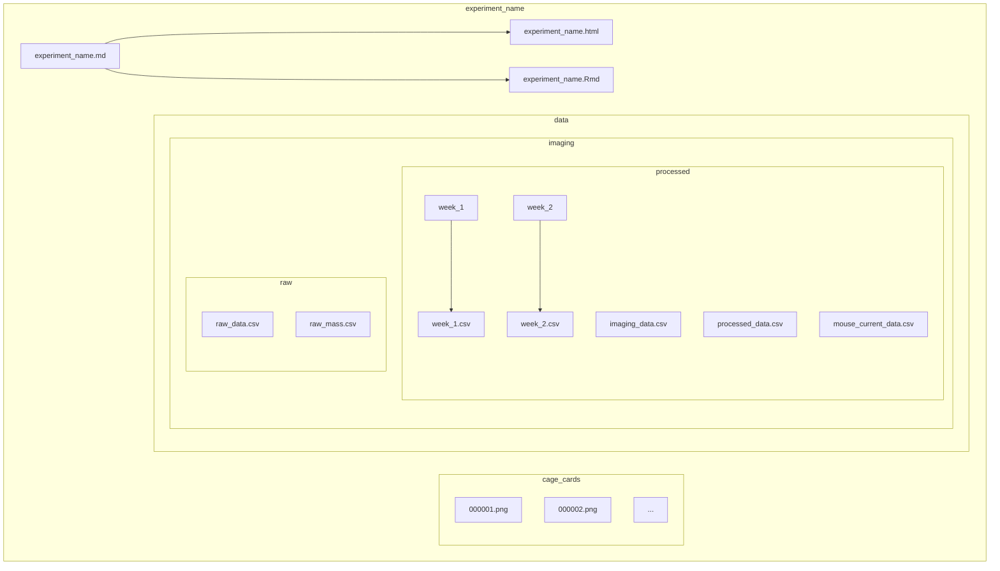

Click on experiment_name.html for viewing the experiment.

Here is the folder hierarchy:

```mermaid
graph TB
  subgraph experiment_name
    experiment_name.md --> experiment_name.html
    experiment_name.md --> experiment_name.Rmd
    subgraph cage_cards
      000001.png
      000002.png
      ...
    end

    subgraph data
      subgraph imaging
        subgraph processed
          week_1 --> week_1.csv
          week_2 --> week_2.csv
        end
        subgraph raw
          week_1
          week_2
        end
      end

      subgraph processed
        imaging_data.csv
        processed_data.csv
        mouse_current_data.csv
      end

      subgraph raw
        raw_data.csv
        raw_mass.csv
      end
    end
  end
```
