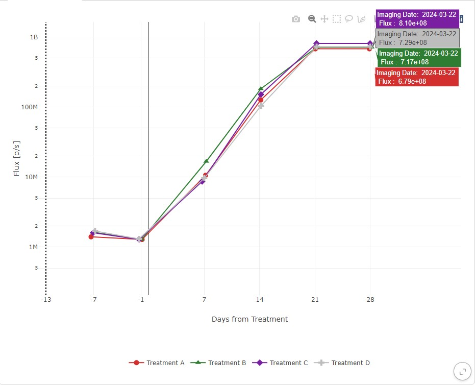
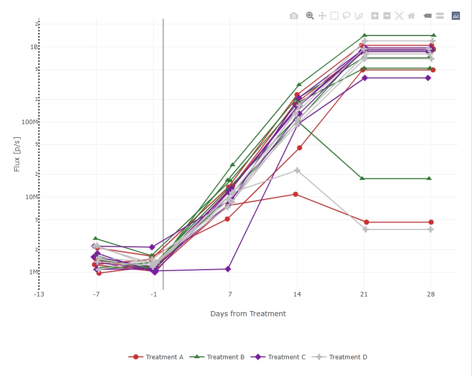
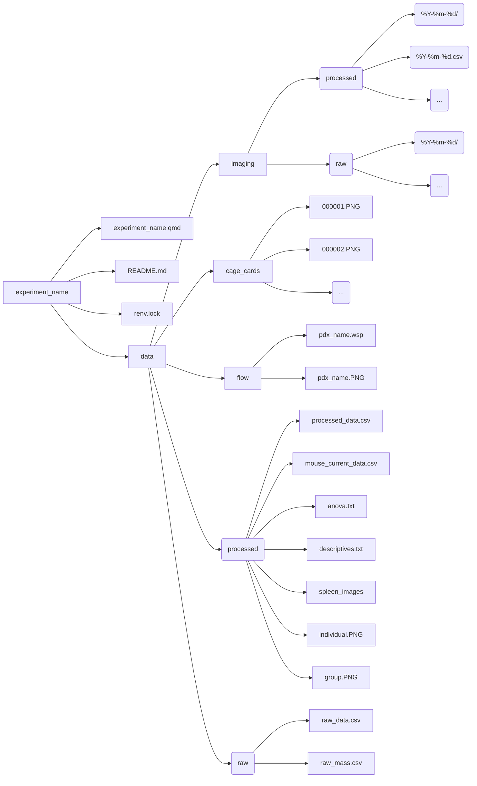

# Summary

000-Template is the repo for a blank template with no mock data.

# Load the .qmd file into R, download the necessary packages, then run document to see the experiment.

This is a template I made for making reproducable, replicable, templateable, modular, and accurate experimental documentation for studies involving bioluminescent imaging.

My goal is to neatly package all experimental aspects together to provide an exhaustive yet succinctly navigable format.

The top of the `.qmd` file must be modified with respect to specific experimental parameters. Then, the `.qmd` file is run using R through `format: dashboard:` and `server: shiny` for an interactive and user-friendly dashboard.

Just to reiterate: **YOU NEED TO RUN THE `.qmd` FILE IN RStudio IN ORDER TO SEE THE DATA IN A NICE USER-FRIENDLY FORMAT!!!**

`raw_data.csv` and `raw_mass.csv` must be manually edited as the experiment progresses.

The output files from Living Image® are manually added to the path `data/imaging/raw/{{%Y-%m-%d}}/`. After processing, these raw files can be deleted so as to conserve storage space. It's okay, all of the data is still retained in the processed files.

The processed output files from Living Image® are manually added to the path `data/imaging/processed/{{%Y-%m-%d}}/`. For each week, one file is a `.csv` and one is a folder containing processed Living Image® data.

Here is the folder hierarchy:

- **experiment_name/**
  - *experiment_name.qmd*: Quarto file for knitting experimental documentation into a dashboard with shiny app and plotly configuration
  - *README.md*: Documentation and support file for understanding experimental nuances amd folder hierarchy
  - *renv.lock*: Records package versions and dependencies for reproducibility
  - *manifest.json*: Records the project's package dependencies and versions, ensuring consistent and reproducible environments across collaborators using `renv`.
  - **data/**
    - **imaging/**
      - **processed/**
        - *{{%Y-%m-%d}}/*: Contains processed Living Image data for {{%Y-%m-%d}}
        - *{{%Y-%m-%d}}.csv*: Contains imaging data for {{%Y-%m-%d}}
        - ...
      - **raw/**: (Since processed imaging data combines raw imaging data, you can delete this so as to conserve storage space)
        - *{{%Y-%m-%d}}/*: Contains unprocessed Living Image data for {{%Y-%m-%d}}
        - ...
    - **cage_cards/**
      - *000001.PNG* (PNG must be capitalized)
      - *000002.PNG* (PNG must be capitalized)
      - ...
    - **flow/**
      - *pdx_name.wsp*
      - *pdx_name.PNG* (PNG must be capitalized)
      - ...
    - **processed/**
      - *processed_data.csv*: Contains all experimental data
      - *anova.txt*: ANOVA output
      - *descriptives.txt*: Descriptives output
      - *spleen_images/*: Contains images of harvested spleens
      - *individual.PNG*: Line plot of individual mice colored by treatment (PNG must be capitalized)
      - *group.PNG*: Line plot of mice grouped and colored by treatment (PNG must be capitalized)
    - **raw/**
      - *raw_data.csv*: Contains all experimental subjects' data except imaging_data data and mass data
      - *raw_mass.csv*: Contains mass of all mice
     

# Help
- If a package error occurs, run `renv::restore()` to ensure the project's library matches the package versions and dependencies specified in the `renv.lock` file.