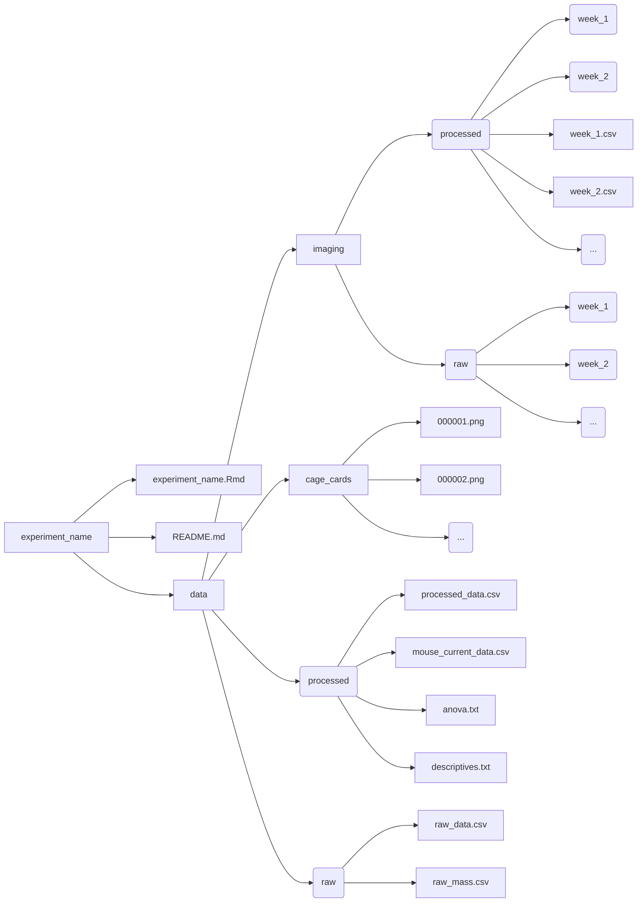

This is a template I made for making reproducable, replicable, templateable, modular, and accurate experimental documentation for studies involving bioluminescent imaging.

My goal is to neatly package all experimental aspects together to provide an exhaustive yet succinctly navigable format.

The top of the .Rmd file must be modified with respect to specific experimental parameters. Then, the .Rmd file is knitted to .html for a user-friendly report.

*raw_data.csv* and *raw_mass.csv* must be manually edited. The output .csv files from Living Image® are manually added to *data/imaging/raw/week_#/*

Here is the folder hierarchy:

- **experiment_name/**
  - *experiment_name.Rmd*: R Markdown file for knitting experimental documentation into a flexdashboard with shiny app and plotly configuration
  - *README.md*: Dcoumentation and support file for understanding folder hierarchy
  - **data/**
    - **imaging/**
      - **processed/**
        - *week_1/*: Contains processed Living Image data for Week 1
        - *week_2/*: Contains processed Living Image data for Week 2
        - *week_1.csv*: Contains imaging data for Week 1
        - *week_2.csv*: Contains imaging data for Week 2
        - ...
      - **raw/**: (Since processed imaging data combines raw imaging data, you can delete this so as to conserve storage space)
        - *week_1/*: Contains unprocessed Living Image data for Week 1
        - *week_2/*: Contains unprocessed Living Image data for Week 2
        - ...
    - **cage_cards/**
      - *000001.png*
      - *000002.png*
      - ...
    - **processed/**
      - *processed_data.csv*: Contains all experimental data
      - *mouse_current_data.csv*: Contains currently relevant mouse data for tracking (used for physical printing)
      - *anova.txt*: ANOVA output
      - *descriptives.txt*: Descriptives output
    - **raw/**
      - *raw_data.csv*: Contains all experimental subjects' data except imaging_data data and mass data
      - *raw_mass.csv*: Contains mass of all mice
     

